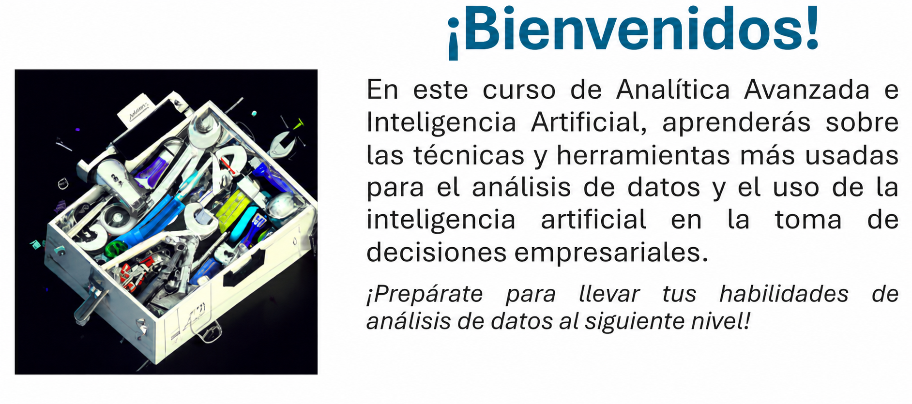

---

## 📚 Sobre este Material

Este material ha sido diseñado con el propósito de **capacitar, actualizar y practicar** conceptos fundamentales de Markdown en Jupyter Notebook. Es una herramienta pensada para facilitar el aprendizaje y la documentación efectiva de proyectos de análisis de datos y ciencia de datos.

### 🤝 Compartir y Colaborar

Este contenido es **libre para compartir, revisar, divulgar y mejorar**. Se promueve activamente su distribución en la comunidad para que más personas puedan beneficiarse y contribuir a su mejora continua. Tu feedback y sugerencias son siempre bienvenidos.

### 👨‍💻 Autor

**Andrés Muñoz**  
*AI & Data Strategy Leader passionate about NLP, LLMs, and MLOps. Driving innovation with data*

- 💼 LinkedIn: [in/amms1989](https://linkedin.com/in/amms1989)
- 🐙 GitHub: [https://github.com/anguihero](https://github.com/anguihero)

---

# Bienvenida y acuerdos del curso

## Contenido

1. Saludo de bienvenida.
2. Presentación de los participantes.
3. Ruta de aprendizaje.
4. Acuerdos.

## 1. Saludo de bienvenida

* *GPT - Revisado por AMMS*

## 2. Presentación de los participantes

Cada participante comparte brevemente:

- formación académica;
- experiencia laboral y proyectos;
- expectativas del curso y de carrera;
- perfil profesional por el chat de la llamada, si desea compartirlo.

## 3. Ruta de aprendizaje

El curso está organizado en 16 sesiones. El detalle de objetivos, contenidos, notebooks y dependencias se encuentra en [ruta.md](../ruta.md).

## 4. Acuerdos

### Estudio autónomo

- Leer y escuchar materiales relacionados con los temas de la ruta.
- Consultar fuentes como [Ciencia de Datos](https://www.cienciadedatos.net/) y [Diego Calvo](https://www.diegocalvo.es/aprendizaje-supervisado-y-no-supervisado/).
- Experimentar con herramientas abiertas y colaborativas presentadas durante las sesiones.

### Actividades y desafíos

- Las actividades se plantean como oportunidades de práctica.
- Se puede desarrollar un miniproyecto con revisión preliminar.
- Se realizarán actividades cortas para comprobar comprensión.

### Pausas, asistencia y participación

- Se realiza una pausa aproximada de cinco minutos cada hora.
- La asistencia es obligatoria y se registra en cada clase.
- Se espera participación activa, escucha, preguntas y solicitud de retroalimentación.
